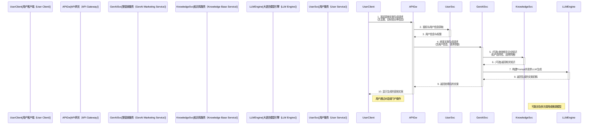

# Huizhu.AI - 智能业务伙伴架构设计文档

## 1. 引言

`huizhu.ai` (智能业务伙伴) 项目旨在构建一个基于生成式 AI、AIOps 与 AI 安全能力的一站式、对话式智能业务运营支持平台。本项目致力于为企业客户解决在营销推广、IT 运维与安全响应、内部协作与知识管理等方面的痛点，通过智能化、自动化的方式提升企业运营效率和决策质量。

本文档详细阐述了 `huizhu.ai` 项目的总体架构设计，包括系统分层、微服务划分、数据架构、技术选型以及详细的模块和文件生成蓝图，为后续的开发工作提供指导。

## 2. 架构驱动因素与设计原则

### 2.1. 核心需求

*   **多场景营销支持**：自动化营销素材生成、竞品分析、市场趋势洞察。
*   **智能客服与维护**：基于知识库的自动应答、多轮对话、客服对话分析。
*   **IT 运维与安全事件响应**：基础设施监控告警、根因分析、安全事件检测与处置建议、合规报告生成。
*   **企业内部协同与知识管理**：会议纪要自动生成、合同文件比对审查、SOP 智能检索。
*   **统一门户与多角色权限**：多租户支持、精细化权限控制、跨端访问。

### 2.2. 系统需求

*   **微服务架构**：核心服务独立部署、弹性伸缩。
*   **容器化与编排**：采用 Kubernetes。
*   **高效模型训练与推理**：混合云架构，低延迟推理服务。
*   **健壮的数据管理与安全**：多类型数据存储、RAG、数据脱敏、RBAC/ABAC、日志审计、mTLS。
*   **优秀的用户界面与交互**：对话式 AI 助手、模块化业务门户、移动端兼容。
*   **高可扩展性与可运维性**：弹性伸缩、全面监控告警、分布式追踪、CI/CD。

### 2.3. 设计原则

*   **分层与模块化**：清晰的多层架构，模块高内聚、低耦合。
*   **借鉴与创新**：吸收参考项目优点，并进行优化创新。
*   **端到端价值导向**：设计直接映射用户价值。
*   **可测试性**：易于单元、集成、端到端测试。
*   **可观测性**：内建日志、指标、追踪。
*   **可靠性与容错性**：集中的错误处理机制。
*   **高性能与可伸缩性**：支持水平扩展。
*   **安全性**：设计初期即考虑安全因素。
*   **代码质量与可维护性**：遵循 Clean Code 原则。

## 3. 系统架构

### 3.1. 总体分层架构

系统采用经典的多层架构，确保各层职责清晰，易于维护和扩展。

```mermaid
graph TD
    subgraph USER_LAYER[用户交互层（User Interface Layer）]
        direction LR
        UI_Chat[对话式AI助手（Conversational AI Assistant）]
        UI_Portal[统一业务门户（Unified Business Portal）]
    end

    subgraph GW_LAYER[API网关层（API Gateway Layer）]
        API_Gw[API网关（API Gateway）<br/>路由、认证、限流、监控]
    end

    subgraph SERVICE_LAYER[核心服务层（Core Services Layer）]
        direction LR
        subgraph MICROSERVICES[微服务集群（Microservices Cluster）]
            MS_GenAI[慧营销服务（GenAI Marketing Service）]
            MS_AIOps[慧运维服务（AIOps Service）]
            MS_AISec[慧安全服务（AI Security Service）]
            MS_Collab[慧协同服务（Collaboration Service）]
            MS_Knowledge[知识库服务（Knowledge Base Service）]
            MS_User[用户管理服务（User Management Service）]
            MS_Analytics[数据分析服务（Data Analytics Service）]
            MS_Billing[计费服务（Billing Service）]
            MS_Notification[通知服务（Notification Service）]
        end
    end

    subgraph DATA_LAYER[数据与知识层（Data & Knowledge Layer）]
        direction LR
        DS_KnowledgeBase[企业知识库（Enterprise Knowledge Base）<br/>文档、SOP、案例]
        DS_BusinessData[业务数据（Business Data）<br/>CRM、ERP - 需授权]
        DS_PlatformData[平台数据（Platform Data）<br/>安全日志、监控数据]
        DS_PublicData[公共数据（Public Data）<br/>行业资讯、市场趋势]
        DS_SystemDB[系统数据库（System Databases）<br/>用户、配置、元数据]
        DS_VectorDB[向量数据库（Vector Database）<br/>用于RAG]
        DS_TSDB[时序数据库（Time Series Database）<br/>监控指标]
        DS_LogStore[日志存储（Log Storage）<br/>审计与分析日志]
        DS_ObjectStore[对象存储（Object Storage）<br/>模型、素材、报告]
    end

    subgraph INFRA_LAYER[基础设施层（Infrastructure Layer）]
        direction LR
        INFRA_K8S[Kubernetes集群（Kubernetes Cluster）]
        INFRA_Models[AI模型（AI Models）<br/>大语言模型、行业模型、AIOps/安全模型]
        INFRA_MQ[消息队列（Message Queue）<br/>服务间异步通信]
        INFRA_Cache[分布式缓存（Distributed Cache）]
    end

    USER_LAYER --> API_Gw
    API_Gw --> MICROSERVICES
    MICROSERVICES --> INFRA_MQ
    MICROSERVICES --> DS_SystemDB
    MICROSERVICES --> DS_VectorDB
    MICROSERVICES --> DS_TSDB
    MICROSERVICES --> DS_LogStore
    MICROSERVICES --> DS_ObjectStore
    MICROSERVICES --> INFRA_Cache
    MICROSERVICES -- 调用/微调 --> INFRA_Models
    MS_Knowledge -- 管理 --> DS_KnowledgeBase
    MS_Analytics -- 分析 --> DS_BusinessData
    MS_AIOps -- 分析 --> DS_PlatformData
    MS_GenAI -- 利用 --> DS_PublicData

    DS_KnowledgeBase -- RAG --> MS_Knowledge
    DS_BusinessData -- 输入 --> MS_Analytics
    DS_PlatformData -- 输入 --> MS_AIOps
    DS_PublicData -- 输入 --> MS_GenAI


    classDef user fill:#c9f,stroke:#333,stroke-width:2px;
    classDef api fill:#orange,stroke:#333,stroke-width:2px;
    classDef service fill:#lightgreen,stroke:#333,stroke-width:2px;
    classDef data fill:#lightblue,stroke:#333,stroke-width:2px;
    classDef infra fill:#lightgrey,stroke:#333,stroke-width:2px;

    class USER_LAYER,UI_Chat,UI_Portal user;
    class GW_LAYER,API_Gw api;
    class SERVICE_LAYER,MICROSERVICES,MS_GenAI,MS_AIOps,MS_AISec,MS_Collab,MS_Knowledge,MS_User,MS_Analytics,MS_Billing,MS_Notification service;
    class DATA_LAYER,DS_KnowledgeBase,DS_BusinessData,DS_PlatformData,DS_PublicData,DS_SystemDB,DS_VectorDB,DS_TSDB,DS_LogStore,DS_ObjectStore data;
    class INFRA_LAYER,INFRA_K8S,INFRA_Models,INFRA_MQ,INFRA_Cache infra;
```




**架构解读**：

* **用户交互层**：提供对话式 AI 助手（例如基于 WebSocket 的聊天界面）和统一业务门户（例如基于 React/Vue 的 Web 应用），支持桌面和移动端访问。
* **API 网关层**：作为系统的统一入口，负责请求路由、认证鉴权（JWT）、API 限流、协议转换、日志记录和初步监控。推荐使用如 Traefik、Kong 或自研网关。
* **核心服务层**：由一系列松耦合的微服务组成，每个微服务关注特定的业务领域。服务间通信优先考虑 gRPC，对于需要异步处理的场景，则采用消息队列（如 Kafka、RabbitMQ）。

  * **慧营销服务 (GenAI Marketing Service)**：负责营销文案生成、市场分析、竞品洞察等。
  * **慧运维服务 (AIOps Service)**：负责 IT 故障诊断、日志关联分析、根因定位。
  * **慧安全服务 (AI Security Service)**：负责安全事件解读、处置建议、合规报告。
  * **慧协同服务 (Collaboration Service)**：负责会议纪要、文档比对、流程问答。
  * **知识库服务 (Knowledge Base Service)**：管理企业知识库，提供 RAG 能力，支持文档索引与检索。
  * **用户管理服务 (User Management Service)**：负责用户账户、角色、权限（RBAC/ABAC）、租户管理。
  * **数据分析服务 (Data Analytics Service)**：对业务数据进行分析，为其他服务提供洞察。
  * **计费服务 (Billing Service)**：管理客户订阅、用量统计与计费。
  * **通知服务 (Notification Service)**：负责发送系统告警、业务通知（邮件、短信、App 推送）。
* **数据与知识层**：提供持久化存储和数据管理能力。

  * **企业知识库/业务数据/平台数据/公共数据**：原始数据源。
  * **系统数据库**：关系型数据库 (如 PostgreSQL) 存储结构化数据（用户信息、配置、租户信息等）。
  * **向量数据库**：(如 Milvus, Weaviate) 存储文本和多媒体内容的向量嵌入，用于语义搜索和 RAG。
  * **时序数据库**：(如 Prometheus, Mimir) 存储监控指标和 AIOps 数据。
  * **日志存储**：(如 Elasticsearch) 存储应用日志、审计日志，支持检索和分析。
  * **对象存储**：(如 MinIO) 存储非结构化数据，如 AI 模型、用户上传的媒体文件、生成的报告等。
* **基础设施层**：提供运行环境和基础技术支撑。

  * **Kubernetes 集群**：用于服务部署、编排、弹性伸缩和高可用。
  * **AI 模型**：包括第三方大语言模型 API (如 GPT-4)、开源模型 (如 Llama 系列) 微调版本、以及自研的 AIOps/安全模型。推理服务可采用 Triton Inference Server。
  * **消息队列**：(如 Kafka, RabbitMQ) 用于服务间的异步解耦和事件驱动。
  * **分布式缓存**：(如 Redis) 提升常用数据的访问速度。

### 3.2. 微服务交互示例（简化流程：用户通过AI助手进行营销文案生成）



**流程说明**：

1. 用户通过客户端（对话式AI助手或业务门户）发起营销文案生成请求，提供必要的主题和目标信息。
2. API网关接收请求，首先调用用户服务进行身份验证和权限检查。
3. 用户服务返回用户信息和权限。
4. API网关将验证通过的请求及附带的用户上下文信息转发给慧营销服务。
5. 慧营销服务根据需求，可能会调用知识库服务，检索与当前企业相关的产品信息、品牌调性等作为背景知识。
6. 知识库服务返回检索到的信息。
7. 慧营销服务结合用户输入和可能的企业知识，构建合适的提示（Prompt），调用底层的大语言模型引擎进行文案生成。
8. 大语言模型引擎返回生成的文案初稿。
9. 慧营销服务对初稿进行必要的后处理（如格式调整、敏感词过滤），然后返回给API网关。
10. API网关最终将生成的文案返回给用户客户端进行展示。

### 3.3. 概念部署架构

```mermaid
graph TD
    subgraph INTERNET[互联网（Internet）]
        Users[企业用户（Enterprise Users）<br/>Web/Mobile]
    end

    subgraph DMZ[DMZ区]
        LB_External[外部负载均衡器（External Load Balancer）]
        WAF[Web应用防火墙（WAF）]
        APIGateway[API网关（API Gateway）]
    end

    subgraph K8S_CLUSTER[Kubernetes集群（Kubernetes Cluster） - 生产环境]
        direction LR
        subgraph K8S_MASTER[Master节点（Master Nodes）]
            KubeAPI[API Server]
            Etcd[etcd]
            Scheduler[Scheduler]
            ControllerManager[Controller Manager]
        end

        subgraph K8S_WORKERS[Worker节点（Worker Nodes）]
            subgraph POD_GROUP_CORE[核心业务服务Pod（Core Business Service Pods）]
                GenAISvc_Pod[慧营销服务实例（GenAI Service Instance）]
                AIOpsSvc_Pod[慧运维服务实例（AIOps Service Instance）]
                AISecSvc_Pod[慧安全服务实例（AI Security Service Instance）]
                CollabSvc_Pod[慧协同服务实例（Collaboration Service Instance）]
                %% ... 其他核心服务
            end

            subgraph POD_GROUP_SUPPORT[支撑服务Pod（Supporting Service Pods）]
                UserSvc_Pod[用户服务实例（User Service Instance）]
                KnowledgeSvc_Pod[知识库服务实例（Knowledge Service Instance）]
                NotificationSvc_Pod[通知服务实例（Notification Service Instance）]
                %% ... 其他支撑服务
            end

            subgraph POD_GROUP_INFRA[基础设施组件Pod（Infrastructure Component Pods）]
                Monitoring[监控代理（Monitoring Agent）<br/>Prometheus Node Exporter]
                Logging[日志代理（Logging Agent）<br/>Fluentd/Filebeat]
                Tracing[追踪代理（Tracing Agent）<br/>OpenTelemetry Collector]
            end

             InferenceServer_Pod[AI模型推理服务（AI Model Inference Server）<br/>Triton / TorchServe]
        end

        LB_Internal[内部负载均衡器（Internal Load Balancer）]
        IngressController[Ingress控制器（Ingress Controller）]
    end

    subgraph DATA_STORAGE_SERVICES[数据存储服务（Data Storage Services） - 可云托管或自建]
        direction TB
        RelationalDB[关系型数据库（Relational DB）<br/>PostgreSQL/MySQL]
        VectorDB[向量数据库（Vector DB）<br/>Milvus/Weaviate]
        TSDB[时序数据库（TSDB）<br/>Prometheus/Mimir]
        LogStoreES[日志存储（Log Store）<br/>Elasticsearch]
        ObjectStoreS3[对象存储（Object Storage）<br/>MinIO/S3]
        MessageQueue[消息队列（Message Queue）<br/>Kafka/RabbitMQ]
        Cache[分布式缓存（Distributed Cache）<br/>Redis]
    end

    subgraph CI_CD_MONITORING[CI/CD与监控平台（CI/CD & Monitoring Platform）]
        CICD_Jenkins[CI/CD流水线（CI/CD Pipeline）<br/>Jenkins/GitLab CI/ArgoCD]
        Metrics_Grafana[指标可视化（Metrics Visualization）<br/>Grafana]
        Logs_Kibana[日志可视化（Log Visualization）<br/>Kibana]
        Tracing_Jaeger[分布式追踪（Distributed Tracing）<br/>Jaeger/Zipkin]
    end

    Users --> LB_External
    LB_External --> WAF
    WAF --> APIGateway
    APIGateway -- HTTPS --> IngressController
    IngressController -- 路由 --> LB_Internal
    LB_Internal -- 负载均衡 --> POD_GROUP_CORE
    LB_Internal -- 负载均衡 --> POD_GROUP_SUPPORT

    POD_GROUP_CORE -- 数据读写 --> DATA_STORAGE_SERVICES
    POD_GROUP_SUPPORT -- 数据读写 --> DATA_STORAGE_SERVICES
    POD_GROUP_CORE -- 调用 --> InferenceServer_Pod
    InferenceServer_Pod -- 加载模型 --> ObjectStoreS3 %% 模型文件存储在对象存储

    K8S_WORKERS -- 监控数据 --> Metrics_Grafana
    K8S_WORKERS -- 日志数据 --> Logs_Kibana
    K8S_WORKERS -- 追踪数据 --> Tracing_Jaeger

    %% Connections to infrastructure components within pods
    GenAISvc_Pod -.-> Monitoring
    GenAISvc_Pod -.-> Logging
    GenAISvc_Pod -.-> Tracing

    %% CI/CD flow (conceptual)
    CICD_Jenkins -- 部署 --> K8S_CLUSTER

    classDef internet fill:#eee,stroke:#333;
    classDef dmz fill:#ffcc99,stroke:#333;
    classDef k8s fill:#ccffff,stroke:#333;
    classDef data_services fill:#e6ffcc,stroke:#333;
    classDef cicd fill:#thistle,stroke:#333;

    class Users internet;
    class LB_External,WAF,APIGateway dmz;
    class K8S_CLUSTER,K8S_MASTER,K8S_WORKERS,KubeAPI,Etcd,Scheduler,ControllerManager,POD_GROUP_CORE,POD_GROUP_SUPPORT,POD_GROUP_INFRA,GenAISvc_Pod,AIOpsSvc_Pod,AISecSvc_Pod,CollabSvc_Pod,UserSvc_Pod,KnowledgeSvc_Pod,NotificationSvc_Pod,InferenceServer_Pod,Monitoring,Logging,Tracing,LB_Internal,IngressController k8s;
    class DATA_STORAGE_SERVICES,RelationalDB,VectorDB,TSDB,LogStoreES,ObjectStoreS3,MessageQueue,Cache data_services;
    class CI_CD_MONITORING,CICD_Jenkins,Metrics_Grafana,Logs_Kibana,Tracing_Jaeger cicd;
```

**部署说明**：

* 用户通过互联网访问，经过外部负载均衡器、WAF 后到达 API 网关。
* API 网关部署在 DMZ 区或 Kubernetes 集群边缘，作为流量入口。
* 核心业务服务和支撑服务均作为容器化应用部署在 Kubernetes (K8s) 集群中，通过 K8s 的服务发现和负载均衡机制进行管理。
* AI 模型推理服务（如 Triton Inference Server）独立部署，可以利用 GPU 资源。
* 数据存储服务（数据库、对象存储、消息队列等）可以采用云服务商提供的托管服务，或在独立集群中自建，以保证数据持久性和高可用。
* CI/CD 平台（如 Jenkins, GitLab CI, ArgoCD）负责自动化构建、测试和部署。
* 监控与日志平台（Prometheus, Grafana, ELK Stack, Jaeger/OpenTelemetry）用于收集、展示和分析系统运行状态。

### 3.4. 技术选型概要

* **后端语言与框架**：Golang (主力)
* **前端框架**：React / Vue.js
* **API 网关**：Traefik / Kong / 自研 (基于 Golang)
* **微服务间通信**：gRPC (优先), RESTful API, Message Queue (Kafka/RabbitMQ)
* **容器化与编排**：Docker, Kubernetes
* **AI 模型与框架**：

  * LLMs: OpenAI API, Hugging Face Transformers (微调), LlamaIndex, LangChain
  * AIOps/AISec: StackStorm (参考), 自研模型
  * 推理服务: Triton Inference Server / TorchServe
* **数据存储**：

  * 关系型数据库: PostgreSQL / MySQL
  * 时序数据库: Prometheus / Mimir / InfluxDB
  * 文档/日志库: Elasticsearch
  * 向量数据库: Milvus / Weaviate / Qdrant
  * 对象存储: MinIO / Ceph / AWS S3
  * 分布式缓存: Redis
* **监控与告警**：Prometheus, Grafana, Alertmanager
* **日志与追踪**：ELK Stack (Elasticsearch, Logstash, Kibana), OpenTelemetry, Jaeger
* **CI/CD**：Jenkins / GitLab CI / Argo CD

## 4. 跨领域关注点

### 4.1. 可观测性 (Observability)

* **日志 (Logging)**：所有服务统一使用 `pkg/logger` 进行结构化日志记录。日志将被收集到 Elasticsearch 中，通过 Kibana 进行查询和分析。
* **指标 (Metrics)**：关键业务指标 (KPIs) 和系统性能指标 (CPU, 内存, QPS, 延迟) 通过 Prometheus 采集，Grafana 进行可视化展示和告警。
* **追踪 (Tracing)**：采用 OpenTelemetry 标准，通过 Jaeger 实现分布式链路追踪，帮助定位瓶颈和故障。

### 4.2. 安全性 (Security)

* **认证与授权**：API 网关统一进行认证 (如 JWT)，服务内部通过 RBAC (基于角色) 和 ABAC (基于属性) 进行细粒度权限控制。
* **传输安全**：对外 HTTPS，服务间通信采用 mTLS。
* **数据安全**：敏感数据加密存储 (AES-256)，数据脱敏处理，严格访问控制。
* **代码安全**：遵循安全编码规范，定期代码审计，依赖库漏洞扫描。
* **运行时安全**：WAF 防护，入侵检测 (参考 Wazuh)。
* **合规性**：内置合规自查与报告生成功能。

### 4.3. 错误处理与可靠性

* **统一错误码**：在 `pkg/errors` 中定义全局错误码和错误类型，方便错误传递和客户端识别。
* **重试与熔断**：服务间调用引入重试机制 (如 gRPC retry) 和熔断器 (如 Hystrix-go 或 Resilience4j 思想)。
* **幂等性设计**：对于关键写操作，确保接口幂等性，防止重复处理。
* **优雅下线与启动**：服务实例能够优雅处理关闭信号，完成正在处理的请求。

### 4.4. 配置管理

* **集中配置**：使用配置中心 (如 etcd, Consul, Nacos) 或 Kubernetes ConfigMaps/Secrets 进行配置管理。
* **动态配置**：支持部分配置的热加载。
* **多环境配置**：区分开发、测试、生产等不同环境的配置。

## 5. 项目目录结构 (Golang 标准布局参考)

```
huizhu.ai/
├── api/                               # API 定义 (例如: Protobuf 文件, OpenAPI 规范)
│   └── proto/
│       └── v1/
│           ├── common/                # 通用 protobuf 消息定义
│           ├── genai/                 # 慧营销服务 API
│           ├── aiops/                 # 慧运维服务 API
│           ├── aisec/                 # 慧安全服务 API
│           ├── collaboration/         # 慧协同服务 API
│           ├── knowledge/             # 知识库服务 API
│           ├── user/                  # 用户管理服务 API
│           ├── analytics/             # 数据分析服务 API
│           ├── billing/               # 计费服务 API
│           └── notification/          # 通知服务 API
├── cmd/                               # 各微服务的主程序入口 (main.go)
│   ├── apiserver/                   # API 网关服务
│   ├── genai_service/
│   ├── aiops_service/
│   ├── aisec_service/
│   ├── collaboration_service/
│   ├── knowledge_service/
│   ├── user_service/
│   ├── analytics_service/
│   ├── billing_service/
│   ├── notification_service/
│   └── job_worker/                  # 后台任务处理服务 (可选)
├── configs/                           # 配置文件模板或默认配置
├── deployments/                       # 部署相关文件 (Dockerfile, Kubernetes YAMLs)
│   ├── dockerfiles/
│   └── kubernetes/
├── docs/                              # 项目文档 (如本架构文档)
│   └── architecture.md
├── internal/                          # 项目内部私有代码
│   ├── apiserver/                   # API 网关具体实现
│   │   ├── handler/                 # HTTP/gRPC 处理器
│   │   ├── middleware/              # 中间件
│   │   ├── router/                  # 路由定义
│   │   └── service/                 # 网关调用的下游服务客户端封装 (可选)
│   ├── biz/                         # 统一的业务逻辑层 (DDD中的Domain和Application层)
│   │   ├── common/                  # 跨多个微服务的通用业务逻辑或模型
│   │   ├── genai/                   # 慧营销业务逻辑
│   │   ├── aiops/                   # 慧运维业务逻辑
│   │   ├── aisec/                   # 慧安全业务逻辑
│   │   ├── collaboration/           # 慧协同业务逻辑
│   │   ├── knowledge/               # 知识库业务逻辑
│   │   ├── user/                    # 用户管理业务逻辑
│   │   ├── analytics/               # 数据分析业务逻辑
│   │   ├── billing/                 # 计费业务逻辑
│   │   └── notification/            # 通知业务逻辑
│   │       ├──常量 (constant)
│   │       ├──数据传输对象 (dto)
│   │       ├──领域对象 (entity/model)
│   │       ├──仓库接口 (repository)
│   │       └──用例/服务 (usecase/service)
│   ├── constant/                    # 项目级常量定义
│   ├── data/                        # 数据访问层实现 (仓库实现)
│   │   ├── common/                  # 通用数据访问逻辑 (如事务管理)
│   │   ├── genai_impl/
│   │   ├── aiops_impl/
│   │   ├── ...                      # 其他服务的 data 实现
│   │   └── postgres/                # PostgreSQL 具体实现
│   │   └── elasticsearch/           # Elasticsearch 具体实现
│   │   └── minio/                   # MinIO 具体实现
│   │   └── redis/                   # Redis 具体实现
│   ├── server/                      # gRPC/HTTP 服务器的通用封装和启动逻辑
│   ├── types/                       # 项目级共享数据类型 (非业务特定DTO，如通用请求/响应结构)
│   │   └── enum/                    # 枚举类型
│   └── worker/                      # 后台任务、定时任务的具体实现
├── pkg/                               # 可被外部项目引用的公共库代码
│   ├── auth/                        # 认证鉴权库 (JWT, Casbin 等)
│   ├── cache/                       # 缓存客户端封装
│   ├── config/                      # 配置加载库
│   ├── email/                       # 邮件发送库
│   ├── errors/                      # 自定义错误处理
│   ├── eventbus/                    # 事件总线/消息队列客户端封装
│   ├── grpchelper/                  # gRPC 辅助函数
│   ├── httpclient/                  # HTTP 客户端封装
│   ├── logger/                      # 日志库封装
│   ├── metrics/                     # 指标上报库
│   ├── model/                       # 通用基础模型 (如分页请求/响应)
│   ├── queue/                       # 消息队列生产者/消费者封装
│   ├── storage/                     # 对象存储客户端封装
│   ├── tracing/                     # 分布式追踪封装
│   ├── transport/                   # 网络传输层封装 (gRPC, HTTP server/client)
│   │   ├── grpc/
│   │   └── http/
│   ├── utils/                       # 通用工具函数
│   └── version/                     # 版本信息
├── scripts/                           # 构建、部署、工具等脚本
├── test/                              # 测试相关 (集成测试, E2E 测试)
│   ├── e2e/
│   └── integration/
├── third_party/                       # 第三方代码或工具 (如 proto-gen-go 插件)
├── tools/                             # 项目开发工具 (代码生成器等)
├── web/                               # 前端项目 (React/Vue)
│   ├── huizhu-portal/
│   └── huizhu-chat-assistant/
├── go.mod
├── go.sum
└── Makefile
```

## 6. 参考资料

1. [Standard Go Project Layout](https://github.com/golang-standards/project-layout)
2. [Microservices Patterns](https://microservices.io/patterns/)
3. [Google API Design Guide](https://cloud.google.com/apis/design/)
4. [The Twelve-Factor App](https://12factor.net/)
5. [OpenTelemetry Documentation](https://opentelemetry.io/docs/)
6. [Kubernetes Documentation](https://kubernetes.io/docs/)
7. [gRPC Documentation](https://grpc.io/docs/)
8. [Hugging Face Transformers](https://github.com/huggingface/transformers)
9. [LangChain](https://github.com/langchain-ai/langchain)
10. [LlamaIndex](https://github.com/jerryjliu/llama_index)
11. [Prometheus](https://github.com/prometheus/prometheus)
12. [Grafana](https://github.com/grafana/grafana)
13. [Elasticsearch (ELK Stack)](https://github.com/elastic)
14. [MinIO](https://github.com/minio/minio)
15. [Viper (Configuration)](https://github.com/spf13/viper)
16. [Zap (Logging)](https://github.com/uber-go/zap)
17. [Asynq (Task Queue)](https://github.com/hibiken/asynq)