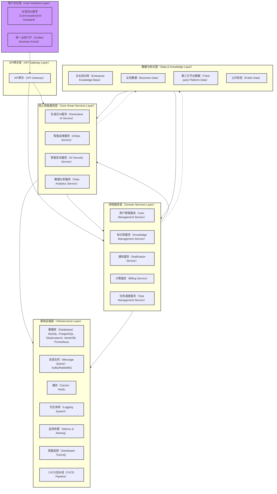
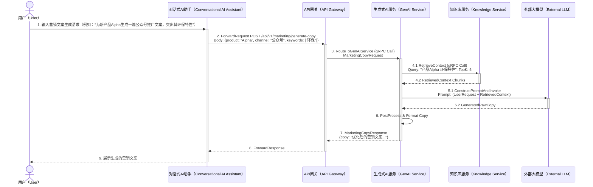

# Huizhu.AI 项目架构设计文档

## 1. 引言

Huizhu.AI （"慧助AI"，企业智能业务伙伴）是一个旨在利用生成式人工智能（Generative AI）、智能运维（AIOps）和人工智能安全（AI Security）技术，为企业客户提供一站式、对话式智能业务运营支持的平台。本项目致力于解决企业在营销推广、IT 运维与安全响应、内部协作与知识管理等方面面临的挑战，通过智能化手段提升运营效率、降低成本并增强决策能力。本文档详细阐述了 Huizhu.AI 的系统架构、设计原则、模块划分、技术选型以及代码实现蓝图，并参考了业界成熟的开源项目与实践[2][3][4]。

## 2. 设计原则

Huizhu.AI 的架构设计遵循以下核心原则：

* **分层与模块化 (Layered & Modular Design)**：采用清晰的多层架构（展现层、应用层、领域层、基础设施层），各模块高内聚、低耦合，易于独立开发、测试、部署和替换。
* **微服务化 (Microservices Architecture)**：核心业务功能拆分为独立的微服务，确保系统的可扩展性、韧性和独立演进能力，借鉴了微服务设计的通用模式[6]。
* **云原生就绪 (Cloud-Native Ready)**：设计上兼容容器化部署（如 Kubernetes [7]），支持弹性伸缩、服务发现和动态配置，遵循十二要素应用[8]的部分理念。
* **模型驱动与数据驱动 (Model-Driven & Data-Driven)**：AI 模型是核心驱动力，同时强调数据的采集、处理、分析与反馈闭环。生成式 AI [1]、AIOps 及 AI 安全模型是关键资产。
* **安全性优先 (Security First)**：从设计源头融入安全考虑，包括数据安全（加密、脱敏）、API 安全（认证、授权）、网络安全（mTLS、WAF）和合规性。
* **可观测性 (Observability)**：内建全面的日志、指标（Metrics）和链路追踪（Tracing）机制，确保系统状态透明可控，参考 Prometheus [9]、ELK [10]、OpenTelemetry [11] 等实践。
* **可扩展性与高性能 (Scalability & High Performance)**：架构需支持水平扩展，关键路径进行性能优化，满足企业级应用需求。
* **开放与集成 (Openness & Integration)**：提供标准 API 接口（如 RESTful、gRPC [12]），易于与企业现有系统（CRM, ERP, 监控系统等）及第三方服务集成。
* **用户体验至上 (User Experience First)**：提供简洁易用的对话式交互界面和统一业务门户，关注不同角色的用户需求。
* **借鉴与创新 (Leverage & Innovate)**：充分吸收业界优秀开源项目（如 LangChain [4]、Hugging Face Transformers [3]、StackStorm [13]、Wazuh [14]、Haystack [15]）的设计思想与实践，结合业务场景进行创新。

## 3. 系统架构

### 3.1 总体逻辑架构

系统逻辑上分为用户交互层、API 网关层、核心智能服务层、领域服务层、基础设施层以及数据与知识层。这种分层结构有助于明确各部分的职责，降低系统复杂度。



**架构解读**：

* **用户交互层（User Interface Layer）**：提供用户与系统交互的界面，包括基于 Web 的对话式 AI 助手和统一业务门户。前端技术栈可选 React/Vue。
* **API 网关层（API Gateway Layer）**：作为系统的统一入口，负责请求路由、认证鉴权、流量控制、API 聚合与转换。可选用如 Kong、APISIX 或基于 Go 自研。
* **核心智能服务层（Core Smart Services Layer）**：封装了项目的核心 AI 能力。这些服务通常是计算密集型，并直接与大模型、AI 算法打交道。
    * `生成式AI服务`：对接底层大语言模型（LLMs）或行业模型，提供文本生成、图片生成、代码生成、RAG（检索增强生成）等能力。
    * `智能运维服务`：负责 IT 故障诊断、日志关联分析、根因分析、预测性维护等。
    * `智能安全服务`：负责安全事件解读、处置建议、合规自查与报告生成。
    * `数据分析服务`：负责对业务数据、运营数据进行分析，提供洞察报告、趋势预测。
* **领域服务层（Domain Services Layer）**：提供支撑业务运营的通用服务。这些服务编排核心智能服务以完成具体业务流程。
    * `用户管理服务`：负责用户账户、角色、权限管理、租户隔离。
    * `知识库服务`：管理企业知识库（文档索引、向量化、元数据），支持 RAG。
    * `通知服务`：负责邮件、短信、站内信等通知的发送。
    * `计费服务`：处理订阅、用量统计与计费（初期可简化或暂缓）。
    * `任务调度服务`：管理异步任务、定时任务，例如报告生成、数据同步等。
* **基础设施层（Infrastructure Layer）**：提供通用的技术支撑能力，如数据库、消息队列、缓存、日志、监控、追踪和 CI/CD 流水线。
* **数据与知识层（Data & Knowledge Layer）**：汇集和管理所有类型的数据源，是 AI 模型训练、微调及推理的基础。

### 3.2 微服务划分与通信

系统将采用微服务架构，上述核心智能服务和领域服务均可设计为独立的微服务。服务间通信优先考虑使用 gRPC [12] 以获得高性能，对于需要外部或浏览器直接访问的场景，API 网关可将 HTTP/WebSocket 请求转换为 gRPC 调用。异步通信和事件驱动场景可采用消息队列（如 Kafka、RabbitMQ）。

### 3.3 部署架构

系统推荐使用 Kubernetes [7] 进行容器编排，实现高可用、弹性伸缩和滚动更新。

```mermaid
graph TD
    %% Legend
    %% subgraph LEGEND [图例（Legend）]
    %%    direction LR
    %%    LEG_USER[用户（User）]
    %%    LEG_K8S_CLUSTER[K8S集群（Kubernetes Cluster）]
    %%    LEG_EXT_DB[外部数据存储（External Data Stores）]
    %%    LEG_EXT_SVC[外部服务（External Services）]
    %% end
    %% class LEGEND fill:#eee,stroke:#333,stroke-width:1px,color:#333;
    %% class LEG_USER fill:#c9f,stroke:#333,stroke-width:1px;
    %% class LEG_K8S_CLUSTER fill:#lightgrey,stroke:#333,stroke-width:1px;
    %% class LEG_EXT_DB fill:#lightblue,stroke:#333,stroke-width:1px;
    %% class LEG_EXT_SVC fill:#lightyellow,stroke:#333,stroke-width:1px;

    USER[用户（User）] -- HTTPS --> INGRESS_CTRL[Ingress控制器（Ingress Controller）]

    subgraph K8S_CLUSTER[K8S集群（Kubernetes Cluster）]
        direction TB 
        %% Changed to TB for better layout of services
        INGRESS_CTRL --> POD_APIGW[Pod：API网关（API Gateway）]

        subgraph CPU_NODES[CPU节点池（CPU Node Pool）]
            direction LR
            POD_APIGW
            POD_USER_SVC[Pod：用户服务（User Service）]
            POD_KNOWLEDGE_SVC[Pod：知识库服务（Knowledge Service）]
            POD_NOTIFY_SVC[Pod：通知服务（Notification Service）]
            POD_TASK_SVC[Pod：任务服务（Task Service）]
            POD_BILLING_SVC[Pod：计费服务（Billing Service）]
        end

        subgraph GPU_NODES[GPU节点池（GPU Node Pool）]
            direction LR
            POD_GENAI_SVC[Pod：生成式AI服务（GenAI Service）]
            POD_AIOPS_SVC[Pod：智能运维服务（AIOps Service）]
            POD_AISEC_SVC[Pod：智能安全服务（AISec Service）]
            POD_DA_SVC[Pod：数据分析服务（Data Analytics Service）]
        end

        %% Observability Pods
        subgraph OBSERVABILITY_NODES[可观测性组件节点池（Observability Node Pool）]
            direction LR
            POD_PROM[Pod：Prometheus]
            POD_GRAFANA[Pod：Grafana]
            POD_ELK[Pod：ELK栈/OpenTelemetry收集器（ELK Stack/OTel Collector）]
        end

        %% Service Interactions
        POD_APIGW -.-> POD_USER_SVC
        POD_APIGW -.-> POD_KNOWLEDGE_SVC
        POD_APIGW -.-> POD_GENAI_SVC
        POD_APIGW -.-> POD_AIOPS_SVC
        POD_APIGW -.-> POD_AISEC_SVC
        POD_APIGW -.-> POD_DA_SVC
        POD_APIGW -.-> POD_NOTIFY_SVC
        POD_APIGW -.-> POD_TASK_SVC
        POD_APIGW -.-> POD_BILLING_SVC

        POD_GENAI_SVC <--> POD_KNOWLEDGE_SVC 
        %% RAG
        %% Other inter-service communications implied

        %% Monitoring data flow
        CPU_NODES --> POD_PROM
        GPU_NODES --> POD_PROM
        POD_PROM --> POD_GRAFANA
        CPU_NODES --> POD_ELK
        GPU_NODES --> POD_ELK
    end

    subgraph DATABASES_EXT[外部数据存储（External Data Stores）]
        direction TB
        SQL_DB[关系型数据库（SQL DB）<br/>MySQL/PostgreSQL]
        TS_DB[时序数据库（TSDB）<br/>Prometheus/Mimir]
        DOC_DB[文档数据库（Document DB）<br/>Elasticsearch]
        OBJ_STORE[对象存储（Object Storage）<br/>MinIO/S3]
        VEC_DB[向量数据库（Vector DB）<br/>Milvus/Weaviate/Qdrant]
    end

    subgraph EXT_SERVICES_API[外部服务API（External Service APIs）]
        direction TB
        LLM_API[大模型API（LLM APIs）<br/>OpenAI/HuggingFace/Local]
        THIRDPARTY_DATA_API[第三方数据API（Third-party Data APIs）<br/>CRM, ERP, Sangfor etc.]
    end

    K8S_CLUSTER -- 数据读写 --> DATABASES_EXT
    K8S_CLUSTER -- API调用 --> EXT_SERVICES_API
    POD_ELK -- 日志存储 --> DOC_DB 
    %% Elasticsearch as part of ELK

    classDef k8s fill:#lightgrey,stroke:#333,stroke-width:2px;
    classDef db fill:#lightblue,stroke:#333,stroke-width:2px;
    classDef ext fill:#lightyellow,stroke:#333,stroke-width:2px;
    classDef user fill:#c9f,stroke:#333,stroke-width:2px;
    classDef obs fill:#e6e6fa,stroke:#333,stroke-width:2px;


    class K8S_CLUSTER,CPU_NODES,GPU_NODES,INGRESS_CTRL,POD_APIGW,POD_USER_SVC,POD_KNOWLEDGE_SVC,POD_NOTIFY_SVC,POD_TASK_SVC,POD_BILLING_SVC,POD_GENAI_SVC,POD_AIOPS_SVC,POD_AISEC_SVC,POD_DA_SVC k8s;
    class OBSERVABILITY_NODES,POD_PROM,POD_GRAFANA,POD_ELK obs;
    class DATABASES_EXT,SQL_DB,TS_DB,DOC_DB,OBJ_STORE,VEC_DB db;
    class EXT_SERVICES_API,LLM_API,THIRDPARTY_DATA_API ext;
    class USER user;
```



**部署架构说明**：

* 所有微服务都将容器化，并通过 Kubernetes 进行编排。
* 根据资源需求（CPU密集型 vs GPU密集型），可以将 Pod 调度到不同的节点池。
* Ingress Controller 负责外部流量的接入和路由到 API 网关。
* 各服务按需访问外部数据存储集群（关系型数据库、文档数据库、时序数据库、对象存储、向量数据库）。
* AI 服务可能需要调用外部大模型 API 或本地部署的模型推理服务（如 Triton Inference Server）。
* 集成 Prometheus 和 Grafana 进行监控，ELK/OpenTelemetry 进行日志收集与分析，这些组件自身也作为 Pod 运行在 K8s 集群中。

### 3.4 核心业务流程示例：慧营销-基于RAG的文案生成

此流程展示了用户如何通过对话式AI助手，结合企业知识库（通过RAG技术）生成营销文案。



**流程说明**：
1.  用户通过对话式 AI 助手提出营销文案生成需求，指明产品、渠道和关键词。
2.  UI 将请求发送至 API 网关。
3.  API 网关将请求路由到生成式 AI 服务。
4.  生成式 AI 服务首先调用知识库服务，根据产品名和关键词检索相关的背景知识、产品说明、过往优秀案例等（此为 RAG 中的 Retrieval 步骤）。
5.  知识库服务返回相关的知识片段。
6.  生成式 AI 服务将用户原始请求与检索到的知识片段组合成一个增强的提示（Prompt），然后调用底层大模型（LLM）进行文本生成（此为 RAG 中的 Generation 步骤）。
7.  大模型返回生成的初稿。
8.  生成式 AI 服务可能对初稿进行后处理（如格式调整、敏感词过滤等）。
9.  最终将优化后的文案通过 API 网关返回给用户界面展示。

## 4. 技术选型（初步）

* **后端语言与框架**：Golang (Gin/Echo for HTTP REST APIs, gRPC for inter-service communication)
* **前端框架**：Vue.js / React
* **API 网关**：Kong / APISIX / Envoy / 自研基于 Golang
* **容器编排**：Kubernetes (K8s)
* **数据库**：
    * 关系型：PostgreSQL / MySQL (用户数据、业务配置、元数据)
    * 文档型：Elasticsearch (日志、全文检索、部分非结构化知识)
    * 时序型：Prometheus / Mimir / InfluxDB (监控指标、AIOps数据)
    * 向量型：Milvus / Weaviate / Qdrant (RAG知识库向量存储)
    * 对象存储：MinIO / Ceph / S3兼容服务 (模型文件、用户素材、报告、大型文档)
* **消息队列**：Kafka / RabbitMQ / NATS (异步任务、事件驱动)
* **缓存**：Redis
* **AI 框架/库**：
    * LLM 对接：LangChain-Go (如 `github.com/tmc/langchaingo`) / 自研 SDK
    * 模型推理服务：Triton Inference Server (若有本地部署的非LLM模型) / KServe
    * Python AI模块交互：通过 gRPC 或 REST API 与 Go 服务通信，或使用如 `gopy` (不推荐用于生产核心路径)。
* **可观测性**：
    * 日志：ELK Stack (Elasticsearch [10], Logstash, Kibana) / Grafana Loki / OpenTelemetry Collector [11]
    * 监控：Prometheus [9] + Grafana
    * 追踪：OpenTelemetry SDK [11] + Jaeger/Zipkin
* **CI/CD**：GitLab CI / Jenkins / ArgoCD / GitHub Actions

## 5. 项目目录结构 

```
huizhu.ai/
├── api/                            # API定义 (Protobuf, OpenAPI/Swagger specs)
│   └── proto/
│       └── v1/                     # API版本
│           ├── common.proto        # 通用消息类型 (分页, 错误详情等)
│           ├── user.proto          # 用户服务接口定义
│           ├── genai.proto         # 生成式AI服务接口定义
│           ├── aiops.proto         # AIOps服务接口定义
│           ├── aisec.proto         # AISec服务接口定义
│           ├── knowledge.proto     # 知识库服务接口定义
│           ├── dataanalytics.proto # 数据分析服务接口定义
│           ├── notification.proto  # 通知服务接口定义
│           └── billing.proto       # 计费服务接口定义
├── cmd/                            # 各微服务的主程序入口 (main packages)
│   ├── apigateway/                 # API网关服务
│   │   └── main.go
│   ├── user_service/               # 用户服务
│   │   └── main.go
│   ├── genai_service/              # 生成式AI服务
│   │   └── main.go
│   ├── aiops_service/              # AIOps服务
│   │   └── main.go
│   ├── aisec_service/              # AISec服务
│   │   └── main.go
│   ├── knowledge_service/          # 知识库服务
│   │   └── main.go
│   ├── dataanalytics_service/      # 数据分析服务
│   │   └── main.go
│   ├── notification_service/       # 通知服务
│   │   └── main.go
│   ├── billing_service/            # 计费服务
│   │   └── main.go
│   ├── task_service/               # 任务调度服务
│   │   └── main.go
│   └── migration_tool/             # 数据库迁移工具
│       └── main.go
├── configs/                        # 配置文件模板和默认配置
│   ├── config.go                   # 配置加载逻辑
│   ├── defaults.yaml               # 默认配置文件
│   └── user_service.yaml           # 用户服务特定配置示例
├── deployments/                    # 部署相关文件 (Dockerfiles, K8s manifests, Helm charts)
│   ├── dockerfiles/                # Dockerfile定义
│   │   ├── Dockerfile.base         # 基础Go服务镜像
│   │   └── Dockerfile.apigateway   # API网关Dockerfile示例
│   └── kubernetes/                 # Kubernetes manifests
│       ├── common/                 # 通用配置 (ConfigMaps, Secrets)
│       ├── services/               # 各微服务的Deployment, Service, HPA等
│       └── helm-charts/            # Helm Charts (可选)
├── docs/                           # 项目文档 (本文件, 设计文档, API文档等)
│   └── architecture.md
├── internal/                       # 项目内部私有代码, 不可被外部项目导入
│   ├── apigateway/                 # API网关核心逻辑
│   │   ├── handler/                # HTTP/WebSocket处理器
│   │   ├── middleware/             # 中间件 (认证, 日志, 监控)
│   │   └── router/                 # 路由配置
│   ├── service/                    # 各微服务的核心业务逻辑实现 (按服务划分)
│   │   ├── user/                   # 用户服务实现
│   │   │   ├── application/        # 应用层: 编排领域逻辑, 处理用例
│   │   │   ├── domain/             # 领域层: 实体, 值对象, 领域服务, 仓储接口
│   │   │   ├── infrastructure/     # 基础设施层: 数据库实现, 外部服务客户端
│   │   │   └── interfaces/         # 接口层: gRPC/HTTP服务暴露
│   │   ├── genai/                  # GenAI服务实现 (类似结构)
│   │   ├── aiops/                  # AIOps服务实现 (类似结构)
│   │   ├── aisec/                  # AISec服务实现 (类似结构)
│   │   ├── knowledge/              # Knowledge服务实现 (类似结构)
│   │   ├── dataanalytics/          # DataAnalytics服务实现 (类似结构)
│   │   ├── notification/           # Notification服务实现 (类似结构)
│   │   ├── billing/                # Billing服务实现 (类似结构)
│   │   └── task/                   # Task服务实现 (类似结构)
│   ├── platform/                   # 平台级共享内部库 (被各微服务internal代码引用)
│   │   ├── apperrors/              # 应用统一错误定义
│   │   │   ├── errors.go
│   │   │   └── errors_test.go
│   │   ├── config/                 # 内部配置加载辅助 (包装configs/config.go)
│   │   ├── database/               # 数据库连接、CRUD辅助 (gorm, sqlx)
│   │   ├── grpcconn/               # gRPC客户端/服务端连接管理与辅助
│   │   ├── httpclient/             # HTTP客户端辅助
│   │   ├── log/                    # 日志组件封装 (slog, zap, logrus)
│   │   │   ├── logger.go
│   │   │   └── logger_test.go
│   │   ├── messaging/              # 消息队列生产者/消费者封装
│   │   ├── observability/          # 可观测性组件 (metrics, tracing setup)
│   │   │   ├── metrics.go
│   │   │   └── tracing.go
│   │   ├── security/               # 安全相关工具 (token generation/validation, crypto)
│   │   └── util/                   # 通用工具函数 (string, time, etc.)
│   ├── common/                     # 最底层的共享定义 (被platform和service引用)
│   │   ├── constants/              # 全局常量
│   │   │   └── constants.go
│   │   ├── types/                  # 全局共享数据结构/DTO (简单类型，避免循环依赖)
│   │   │   ├── common_api_types.go # 如标准API请求/响应包装
│   │   │   └── common_api_types_test.go
│   │   └── enums/                  # 全局枚举类型
│   │       ├── enums.go
│   │       └── enums_test.go
├── pkg/                            # 可被外部应用导入的公共库 (如Client SDK)
│   └── client/                     # Huizhu.AI的客户端SDK
│       └── huizhu_client.go
├── scripts/                        # 辅助脚本 (构建, 安装, 分析, proto生成等)
│   ├── setup_env.sh                # 开发环境设置
│   ├── build.sh                    # 构建脚本
│   ├── run_tests.sh                # 运行测试脚本
│   └── gen_proto.sh                # 生成protobuf代码脚本
├── test/                           # 测试文件 (集成测试, E2E测试)
│   ├── integration/                # 集成测试
│   └── e2e/                        # 端到端测试
├── web/                            # 前端代码 (Vue/React等) - 独立仓库或monorepo一部分
│   ├── public/
│   ├── src/
│   └── package.json
├── .gitattributes
├── .gitignore
├── go.mod
├── go.sum
└── README.md
```

## 6. 参考资料

[1] OpenAI. (n.d.). *OpenAI API*. Retrieved from `https://platform.openai.com/docs`
[2] GitHub. (n.d.). *golang-standards/project-layout*. Retrieved from `https://github.com/golang-standards/project-layout` (Conceptual reference for Go project structure)
[3] Hugging Face. (n.d.). *Hugging Face Transformers*. Retrieved from `https://huggingface.co/docs/transformers/index`
[4] LangChain AI. (n.d.). *LangChain*. Retrieved from `https://github.com/langchain-ai/langchain` (Conceptual reference for Go: `https://github.com/tmc/langchaingo`)
[5] Liu, J. (n.d.). *LlamaIndex (formerly GPT Index)*. Retrieved from `https://github.com/jerryjliu/llama_index`
[6] Richardson, C. (n.d.). *Microservices Patterns*. Retrieved from `https://microservices.io/`
[7] Kubernetes. (n.d.). *Kubernetes Documentation*. Retrieved from `https://kubernetes.io/docs/`
[8] Wiggins, A. (n.d.). *The Twelve-Factor App*. Retrieved from `https://12factor.net/`
[9] Prometheus. (n.d.). *Prometheus - Monitoring system & time series database*. Retrieved from `https://prometheus.io/docs/introduction/overview/`
[10] Elastic. (n.d.). *The ELK Stack: Elasticsearch, Logstash, Kibana*. Retrieved from `https://www.elastic.co/elastic-stack`
[11] OpenTelemetry. (n.d.). *OpenTelemetry Documentation*. Retrieved from `https://opentelemetry.io/docs/`
[12] gRPC. (n.d.). *gRPC Documentation*. Retrieved from `https://grpc.io/docs/what-is-grpc/introduction/`
[13] StackStorm. (n.d.). *StackStorm - Event-driven automation*. Retrieved from `https://github.com/StackStorm/st2`
[14] Wazuh. (n.d.). *Wazuh - Open Source XDR and SIEM*. Retrieved from `https://github.com/wazuh/wazuh`
[15] deepset. (n.d.). *Haystack - End-to-End NLP Frameworks*. Retrieved from `https://github.com/deepset-ai/haystack`
[16] Gin Web Framework. (n.d.). *Gin Web Framework Documentation*. Retrieved from `https://gin-gonic.com/docs/`